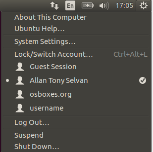

#Getting Started with Ubuntu

##Add a new user with sudo privileges

Login as a root user using the default username and password.

```sh
root@osboxes:~# useradd username

root@osboxes:~# usermod -G sudo username

root@osboxes:~# id username
uid=1002(username) gid=1002(username) groups=1002(username),27(sudo)

root@osboxes:~# passwd username
Enter new UNIX password:
Retype new UNIX password:
passwd: password updated successfully
```

The new user will appear in the Ubuntu UI



##Update default software's 

```sh
apt-get update
```

[...more information about apt-get update](./apt-get-update.md)

##Additional add-on's

**Hitting arrow keys adds characters in vi editor**

Install vim to fix this issue...

```sh
sudo apt-get install vim
```

[Reference](http://askubuntu.com/questions/353911/hitting-arrow-keys-adds-characters-in-vi-editor)

sudo apt-get install openssh-server openssh-client

sudo mkdir /appl
chown -R allan:root /appl

apt-get install git

apt-get install yum

apt-get install yum-utils


